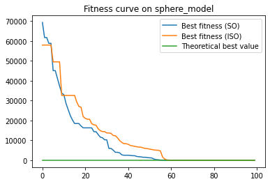

## Introduction

[Snake Optimizer (SO)](https://www.sciencedirect.com/science/article/abs/pii/S0950705122001150) is an evolutionary optimization algorithm. This repository provides an improved version of SO (ISO). We test both versions on several functions. The results indicate that search range and convergence rate cannot be achieved simultaneously. To obtain better results, we have to sacrifice convergence rate to expand the search range. More details can be found in the [reference](https://d.wanfangdata.com.cn/periodical/wjfz202405017)  (This paper is in Chinese).

## Usage

Run `test_function.py`. The results containing fitness curves and optimal values will be shown. You can observe and compare the results of both versions.

The meaning of parameters are as follows:

* dim: The dimension of testing functions
* max_iter: The maximum iterations
* population_size: The size of population
* solution_bound: The range of arguments

## Example

Here we provide an optimization example on Sphere Function, which has a simple definition:
$$
f(X)=\sum_{i=1}^{\text{dim} }X_i^2 .
$$
The fitness curve is as follows.



 It can be observed that ISO has a slower convergence rate than SO. However, ISO achieves better final result than SO as shown as follows. The same phenomenon occurs in other testing functions. 

```
----SO----
Best solution:  [[-3.07529677e-08  7.61056711e-08  1.62952222e-07 -7.71567506e-08
  -2.30701915e-08 -3.83930674e-08  1.29712186e-07  4.52461610e-08
  -1.42831916e-08  8.10040955e-08  7.85339600e-08 -6.94184376e-08
  -1.60104064e-07 -2.11944326e-07  8.62981664e-08 -1.23060192e-08
  -1.12839286e-07  6.70763685e-08  6.22237415e-08 -9.82211760e-08
   1.29091431e-07 -3.74976817e-09 -3.47325370e-10 -8.49299259e-08
   1.64320138e-08 -9.51314119e-08 -1.23216423e-08 -7.64998144e-08
   1.87206251e-08  6.64271369e-08]]
Best fitness： 2.307579084774835e-13
----ISO----
Best solution:  [[-1.17773883e-11  2.50727495e-10 -7.40239186e-11 -2.93800789e-11
  -9.30714823e-11  3.28959437e-10 -3.24297203e-10  8.92267248e-13
  -5.18187129e-11 -5.83544351e-11  8.39532250e-10 -5.62472379e-11
  -4.17405646e-10 -2.38026631e-10  2.06955027e-10  4.23866848e-11
   2.79108847e-11  9.10331386e-11  1.67014823e-10 -2.15587842e-10
   1.51229737e-10  5.44528416e-11  4.96081966e-10  4.59825347e-11
   2.48533000e-11  3.27843340e-12  5.73482520e-10  3.01149666e-11
   1.02238946e-10 -2.40109469e-11]]
Best fitness： 1.8959354360877344e-18
```

